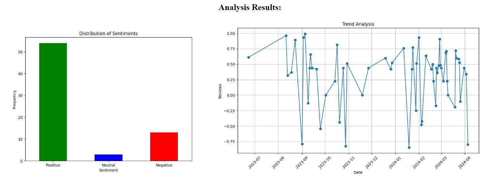

# ReviewSense

## Description
This Python script analyzes product reviews from an Amazon product page, performs sentiment analysis, identifies common problems mentioned in negative reviews, and generates potential solutions using a language model. It also visualizes the distribution of sentiments and trends in review scores over time.

## Dependencies
- [Flask](https://palletsprojects.com/p/flask/): For building web applications
- [requests](https://pypi.org/project/requests/): For making HTTP requests
- [BeautifulSoup](https://pypi.org/project/beautifulsoup4/): For parsing HTML
- [pandas](https://pypi.org/project/pandas/): For data manipulation and analysis
- [nltk](https://pypi.org/project/nltk/): For natural language processing tasks
- [matplotlib](https://pypi.org/project/matplotlib/): For data visualization
- [langchain](https://pypi.org/project/langchain/): For using pre-trained language models
- [datetime](https://docs.python.org/3/library/datetime.html): For handling date and time

## Setup
1. Install the required dependencies using pip:
   ```bash
   pip install Flask requests beautifulsoup4 pandas nltk matplotlib langchain
2. Ensure NLTK data is downloaded
   ```bash
   import nltk
   nltk.download('vader_lexicon')
   nltk.download('stopwords')
   nltk.download('punkt')
   nltk.download('wordnet')
3. Set up OpenAI API key
  - Replace 'Open api key' with your OpenAI API key in the code

## Usage
1. Run the script amazon_product_review_analysis.py.
2. Navigate to http://127.0.0.1:5000/ in your web browser.
3. Enter the URL of the Amazon product page to analyze.
4. The script will process the URL, perform sentiment analysis, identify common problems, and generate potential solutions.
5. Results will be displayed on the web page along with visualization plots

## Work Flow

The landing page of the website is given below. Give the user an area to give the url of the product


The output page contains two charts showing review count and also trend analysis



Output also contains an report that shows the solution for problems idnetified in reviews


## Dataset

- 'amazon_review' file contains the extracted data form website.
- 'clean_text' file contains the data after preprocessing.
- 'sentiment_analysis_result' file contains the data after sentiment score is given

## Additional Information
1. The script utilizes the Flask framework to create a simple web interface for interacting with the analysis functionality.
2. Preprocessing steps include text cleaning, tokenization, stop word removal, and lemmatization.
3. Identified problems are based on predefined keywords associated with common issues mentioned in product reviews.
4. Solutions are generated using a pre-trained language model from LangChain.
5. Results are displayed dynamically on the web page for easy interpretation

## Authors
- Amal Gopi
- Harankumar M.S
- Deepak Nair V.P
- Elvin Jimmy
- Jeeva C.S
   

