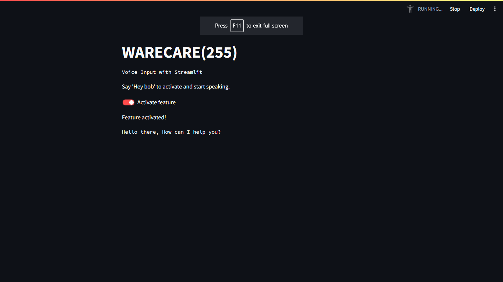
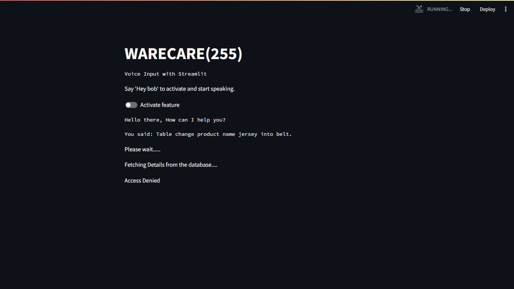

---

# WareCare (255): Warehouse Assistant Application

## Table of Contents
1. [Introduction](#introduction)
2. [Features](#features)
3. [Architecture Overview](#architecture-overview)
4. [Development Stages](#development-stages)
    - [Main File](#main-file)
    - [SQL Query Chain File](#sql-query-chain-file)
5. [Technical Components](#technical-components)
    - [Speech Recognition and Synthesis](#speech-recognition-and-synthesis)
    - [Natural Language Understanding](#natural-language-understanding)
    - [SQL Query Generation](#sql-query-generation)
    - [Validation and Execution](#validation-and-execution)
6. [How to Run the App](#how-to-run-the-app)
7. [Conclusion](#conclusion)

## 1. Introduction 
WareCare (255) is a web application designed to streamline warehouse management by providing a voice-activated assistant, Bob, capable of interpreting natural language queries and generating SQL queries for interaction with the warehouse database. This application aims to assist warehouse personnel who lack expertise in database queries by providing an intuitive and efficient means of accessing warehouse data.

## 2. Features 
- *Voice Activation*: Users can activate the assistant by saying "Hey Bob".
- *Speech Recognition*: Utilizes Microsoft Speech SDK to recognize user voice commands.
- *Text Responses*: Generates text responses using Gemini LLM for user queries and SQL results.
- *Text-to-Speech*: Converts text responses into speech using Microsoft Azure Web Services.
- *Natural Language Understanding*: Analyzes keywords from user queries to determine intent and context.
- *SQL Query Generation*: Converts natural language queries into accurate SQL queries using a specialized SQL query chain system.
- *Validation and Execution*: Validates and executes generated SQL queries against the warehouse database.

## 3. Architecture Overview 
The application architecture consists of two main components: the main file responsible for user interaction and the SQL query chain file for SQL query generation and validation.

## 4. Development Stages 

### Main File 
The main file contains the core logic for user interaction and integration with speech recognition and synthesis services. It follows these key stages:
1. *Framework*: Built in Python using Streamlit for the user interface.
2. *Activation and Speech Recognition*: Utilizes Microsoft Speech SDK for activating the assistant and recognizing user speech.
3. *Text Response Generation*: Generates text responses using Gemini LLM for user queries and system messages.
4. *Text-to-Speech Conversion*: Converts text responses into speech using Microsoft Azure Web Services.
5. *Database Query Handling*: Implements functions to execute and handle database-related queries.
6. *Streamlit Application*: Manages the main function for the Streamlit application, handling user interactions and responses.

### SQL Query Chain File 
The SQL query chain file is responsible for SQL query generation and validation. It involves the following stages:
1. *SQL Query Chain System*: Utilizes Langchain framework and Google Palm LLM for natural language understanding and SQL query generation.
2. *Few-Shot Learning*: Implements few-shot learning techniques for improving query understanding.
3. *Validation*: Validates SQL queries to ensure accuracy using Gemini LLM.
4. *Integration*: Integrates with the main application for handling database-related queries.

## 5. Technical Components 

### Speech Recognition and Synthesis 
- *Speech SDK*: Utilizes Microsoft Speech SDK for recognizing user voice commands and converting text responses into speech.
- *Text-to-Speech*: Converts text responses into speech using Microsoft Azure Web Services.

### Natural Language Understanding 
- *Keyword Analysis*: Analyzes keywords from user queries to determine intent and context.
- *Vector Embeddings*: Utilizes Hugging Face embeddings to represent words or sentences in a multi-dimensional space for semantic understanding.

### SQL Query Generation 
- *SQL Query Chain System*: Utilizes Langchain framework, Google Palm LLM, and Chroma DB for natural language understanding and SQL query generation.
- *Few-Shot Learning*: Implements few-shot learning techniques to improve query understanding based on limited training examples.

### Validation and Execution 
- *Query Validation*: Validates generated SQL queries to ensure syntactic correctness and adherence to database constraints.
- *Database Integration*: Executes validated SQL queries against the warehouse database for data retrieval and manipulation.

## 6. How to Run the App 
To run the app, follow these steps:
1. Ensure all dependencies are installed. You can install dependencies using pip:
    
    pip install -r requirements.txt
    
2. Once dependencies are installed, run the app using the following command:
    
    streamlit run main.py
    

3. When the app starts on the web, the above interface is presented to the user from which the user can interact with our voice assistant through natural language.

4. There are 2 modes for SQL querying. If the toggle is not activated the user is denied permission to make any insertions, updations or deletions in the database as shown above.

5. Once access is activated, the user gets to make changes within the database. Also after each query, the user is asked for confirmation to commit changes. At this point the user can choose to rollback the changes made as well.

## 7. Conclusion 
WareCare (255) offers a user-friendly solution for warehouse personnel to interact with the warehouse database using natural language voice commands. By integrating advanced speech recognition, natural language understanding, and SQL query generation techniques, the application simplifies the query process and empowers users to access warehouse data efficiently.

---
