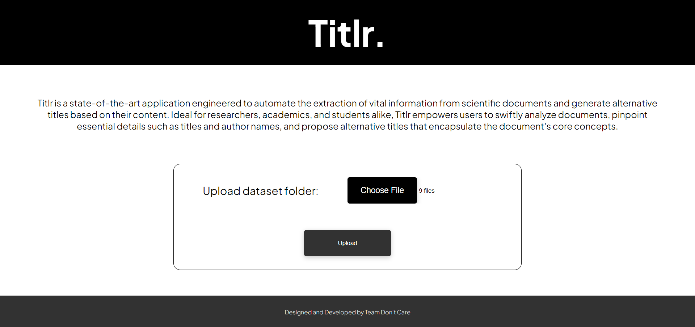
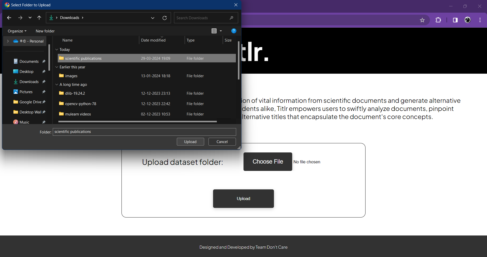
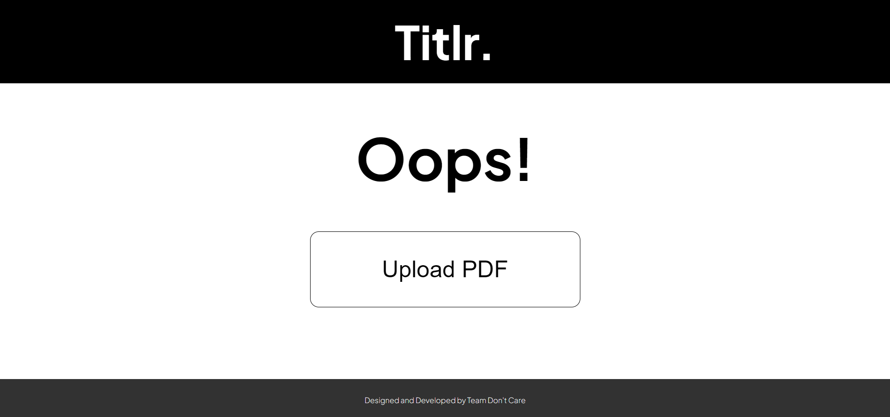
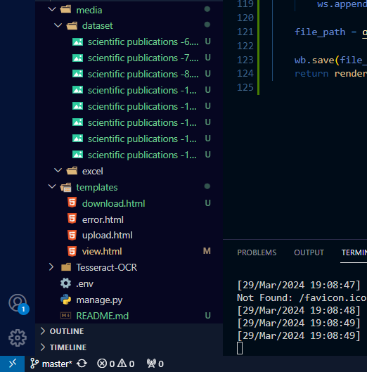
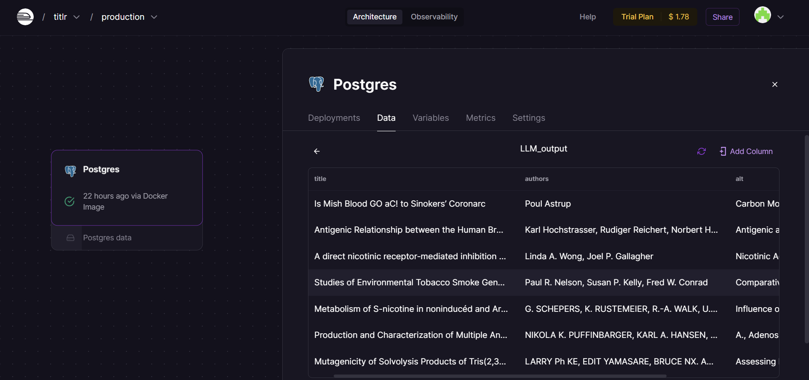
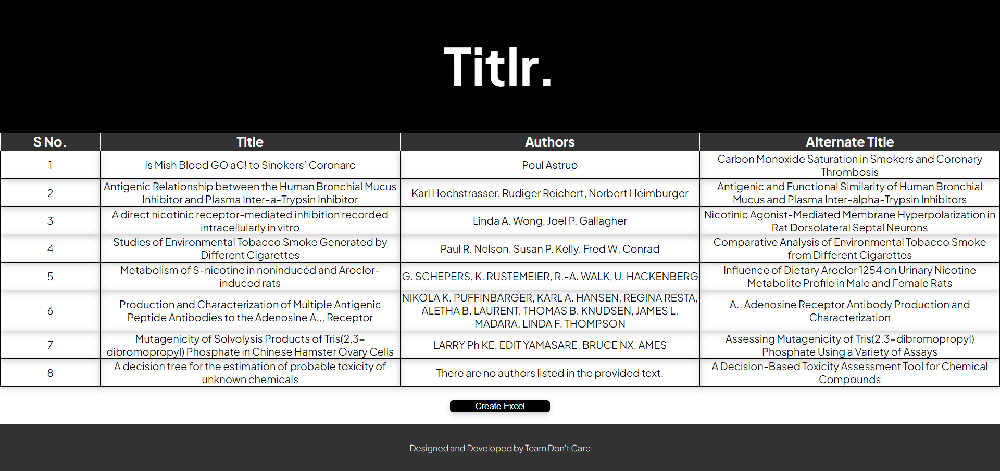
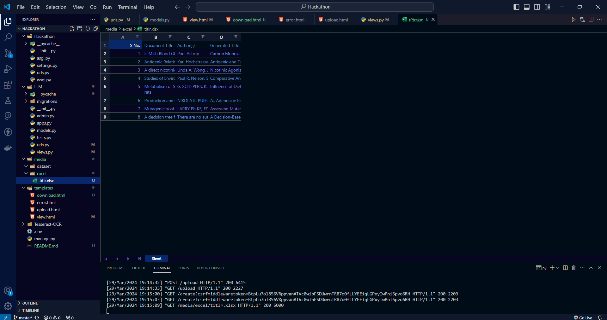
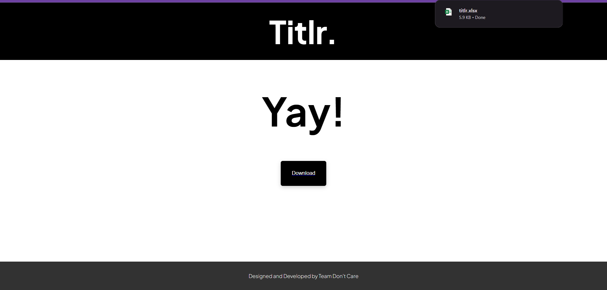
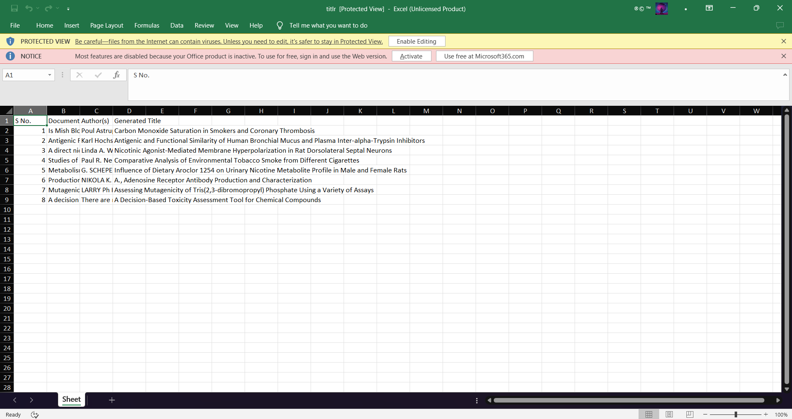

# Titlr

## Team Members:
- **Team Lead:** Vishnu Sudheer
- **Data/ML Engineer:** Suryajit Sudheeran
- **Software Engineer:** Rohit C
- **Documentation/Presentation:** Vishnukant P K and Fadil Abdulla E

## Description of Work:
This website caters to scientists and researchers by offering a tool to analyze scientific papers. You can upload your paper in PNG format. The website then utilizes Tesseract OCR, an optical character recognition engine, to extract text from the image.

Once the text is extracted, the system analyzes it using Gemini 1.0 Pro API, a powerful large language model. This analysis retrieves key information like the title and authors' names from the paper. Additionally, the website generates an alternative title for the paper using its own algorithms.

Finally, you have the flexibility to view the extracted information directly on the website or download it as an Excel sheet for further manipulation and analysis. This allows you to easily access the key details of your research paper and potentially discover a new, interesting title for it.

## System Architecture:

## Work Flow

The landing page of the website is given below. It contains a brief description of the project and also gives the user the option to upload a folder containing the dataset to be processed.

The upload button gives the user the option to choose the specified folder containing dataset images as depicted below.

If there is any error during upload it is displayed to the user.

The uploaded folder is split into individual png files and stored in the dataset folder within the media directory of the project.

The processing of the dataset takes place inside the upload() function in the views.py file within the LLM folder of the project.
The images are parsed one by one and passed to the OCR module of the project and the text extracted by it to the Gemini API via prompts.
LLM returns the title of the content, list of authors and an alternate title apt for the content.
These values are then stored in the database.

Further on this data is integrated into the frontend to display the output in the specified format to the users.

The user is also provided with an option to create an Excel sheet format of the output being displayed by the click of a button.

The excel sheet is created in the excel folder within the media directory of the project.
The user now gets the option to download the excel file onto his/her local system.

The downloaded .xlsx file can be viewed on any excel sheet view supported platforms.

Thus our project, Titlr brings forth a seamless integration of AI, Prompt engineering, Web development and Database management to provide the user with the best results for a variety of datasets.

## Technology Stack
- The project the built using the Django Model-View-Template(MVT) Architecture for full stack web development.
- Tesseract module is being used for text detection from images.
- Google Gemini 1.0 Pro API is used for prompting.
- An online hosted PostgreSQL database is used to store the data extracted through prompts.

## Where to Look

- Refer the 'views.py' file in the LLM folder to get a well documented code of the backend.
- Refer the 'templates' folder to see the HTML pages developed for this project.
- Refer the 'media' folder to view sample dataset and the excel sheet generated for it.
- Refer the '.env' file to know the list of environment variables and API keys required to run this code.
- Install the requirements.txt using the command 'pip install -r requirements.txt'.
- Run the project using the command 'py manage.py runserver'

Regards,

Team Don't Care.
